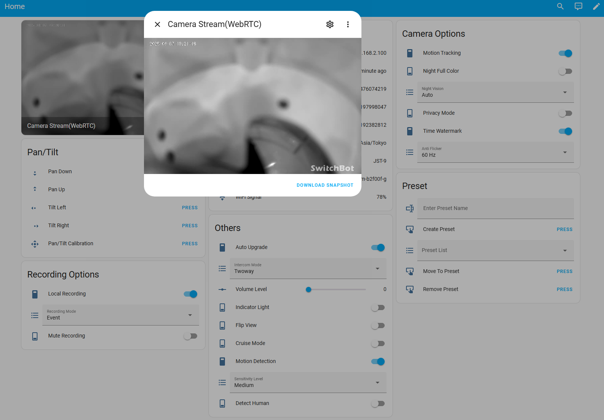

# SwitchBot KVS Camera Custom Component for Home Assistant

Custom Component for Integrating SwitchBot Pan/Tilt Cam **Plus** with Home Assistant

## Supported devices

| Device(ProductPage)                                                                                        | Support |
| ---------------------------------------------------------------------------------------------------------- | :-----: |
| [Outdoor Spotlight Cam 1080P][OutdoorSpotlightCam1080PProduct] [[JP][OutdoorSpotlightCam1080PProductJP]]   |    -    |
| [Outdoor Spotlight Cam 2K(3MP)][OutdoorSpotlightCam2K3MPProduct] [[JP][OutdoorSpotlightCam2K3MPProductJP]] |    -    |
| [Pan/Tilt Cam][PanTiltCamProduct] [[JP][PanTiltCamProductJP]]                                              |    -    |
| [Pan/Tilt Cam 2K(3MP)][PanTiltCam2K3MPProduct] [[JP][PanTiltCam2K3MPProductJP]]                            |    -    |
| [Pan/Tilt Cam Plus 2K(3MP)][PanTiltCamPlus3MPProduct] [[JP][PanTiltCamPlus3MPProductJP]]                   |   ✅    |
| [Pan/Tilt Cam Plus 3K(5MP)][PanTiltCamPlus5MPProduct] [[JP][PanTiltCamPlus5MPProductJP]]                   |   ✅    |
| [Indoor Cam][IndoorCamProduct] [[JP][IndoorCamProductJP]]                                                  |    -    |
| [Video Doorbell][VideoDoorbellProduct] [[JP][VideoDoorbellProductJP]]                                      |   ✅    |

[OutdoorSpotlightCam1080PProduct]: https://www.switch-bot.com/products/switchbot-outdoor-spotlight-cam?variant=43002833338535
[OutdoorSpotlightCam1080PProductJP]: https://www.switchbot.jp/products/switchbot-outdoor-spotlight-cam
[OutdoorSpotlightCam2K3MPProduct]: https://www.switch-bot.com/products/switchbot-outdoor-spotlight-cam?variant=45882280738983
[OutdoorSpotlightCam2K3MPProductJP]: https://www.switchbot.jp/products/switchbot-outdoor-spotlight-cam-3mp
[PanTiltCamProduct]: https://switch-bot.com/pages/switchbot-pan-tilt-cam
[PanTiltCamProductJP]: https://www.switchbot.jp/products/switchbot-pan-tilt-cam
[PanTiltCam2K3MPProduct]: https://switch-bot.com/pages/switchbot-pan-tilt-cam-2k
[PanTiltCam2K3MPProductJP]: https://www.switchbot.jp/products/switchbot-pan-tilt-cam-3mp
[PanTiltCamPlus3MPProduct]: https://us.switch-bot.com/pages/switchbot-pan-tilt-cam-plus-2k
[PanTiltCamPlus3MPProductJP]: https://www.switchbot.jp/products/switchbot-pan-tilt-cam-plus-3mp
[PanTiltCamPlus5MPProduct]: https://us.switch-bot.com/pages/switchbot-pan-tilt-cam-plus-3k
[PanTiltCamPlus5MPProductJP]: https://www.switchbot.jp/products/switchbot-pan-tilt-cam-plus-5mp
[IndoorCamProduct]: https://switch-bot.com/pages/switchbot-indoor-cam
[IndoorCamProductJP]: https://www.switchbot.jp/products/switchbot-indoor-cam
[VideoDoorbellProduct]: https://www.switch-bot.com/products/switchbot-smart-video-doorbell
[VideoDoorbellProductJP]: https://www.switchbot.jp/products/switchbot-smart-video-doorbell

> [!TIP]
> If you want to integrate unsupported devices into Home Assistant:
>
> 1. These devices use TuyaSDK.
> 2. Remove the camera from the SwitchBot app.
> 3. Register the camera in the [Smart Life app](https://play.google.com/store/apps/details?id=com.tuya.smartlife&hl=en).
> 4. You can use the [Tuya integration](https://www.home-assistant.io/integrations/tuya/).

> [!IMPORTANT]
> The following support documentation has been published.
>
> [How to View My SwitchBot Camera's Videos via Home Assistant? – SwitchBot Help Center](https://support.switch-bot.com/hc/en-us/articles/31984833990423-How-to-View-My-SwitchBot-Camera-s-Videos-via-Home-Assistant) [[JP]](https://support.switch-bot.com/hc/ja/articles/31984833990423-Home-Assistant%E3%81%ABSwitchBot%E3%82%AB%E3%83%A1%E3%83%A9%E6%98%A0%E5%83%8F%E3%82%92%E8%A1%A8%E7%A4%BA%E3%81%99%E3%82%8B)
>
> It appears that an official feature enabling operation as an ONVIF/RTSP camera will be offered in the future.
>
> (As of now—June 10, 2025—it was not yet configurable.)

## Supported features for Video Doorbell

| Feature              | Description                                                                           |
| -------------------- | ------------------------------------------------------------------------------------- |
| Camera Stream        | Displays the camera Stream                                                            |

Currently, **Audio is not supported**. This is due to two reasons:

- Specifying an audio codec other than AAC causes the camera to respond with a broken SDP.
- go2rtc (pion?) does not support the AAC codec in WebRTC.

## Supported features for Pan/Tilt Cam Plus

| Feature              | Description                                                                           |
| -------------------- | ------------------------------------------------------------------------------------- |
| Camera Stream        | Displays the camera Stream                                                            |
| Pan/Tilt             | Currently, pressing the button once behaves the same as tapping in the smartphone app |
| Pan/Tilt Calibration |                                                                                       |
| Motion Tracking      | Sets motion tracking                                                                  |
| Night Vision         | Sets night vision                                                                     |
| Night Full Color     | Sets night full color                                                                 |
| Privacy Mode         | Sets privacy mode                                                                     |
| Time Watermark       | Sets the display of date, time, and logo                                              |
| Anti Flicker         | Select anti-flicker 　 mode                                                           |
| **Preset**           | --                                                                                    |
| Create Preset        | Saves the current Pan/Tilt position as a preset with a name                           |
| Remove Preset        | Removes the selected preset from the dropdown                                         |
| Move To Preset       | Moves to the selected preset from the dropdown                                        |
| **Recording**        | --                                                                                    |
| Local Recording      | Sets recording to the SD card                                                         |
| Recording Mode       | Select recording mode                                                                 |
| Mute Recording       | Sets whether to record audio during recording                                         |
| **Configuration**    | --                                                                                    |
| Auto Upgrade         | Sets whether to perform automatic firmware updates                                    |
| Intercom Mode        | Sets the direction of communication                                                   |
| Volume Level         | Sets the communication volume                                                         |
| Cruise Mode          | Sets cruise mode                                                                      |
| Flip View            | Sets the inversion of the video                                                       |
| Motion Detection     | Sets motion detection                                                                 |
| Sensitivity Level    | Sets the sensitivity level of motion detection                                        |
| Detect Human         | Sets human detection for motion detection                                             |
| Indicator Light      | Sets the indicator light                                                              |
| **Diagnostics**      | --                                                                                    |
| IP Address           | Displays the camera's IP address                                                      |
| WiFi Signal          | Displays the WiFi signal strength                                                     |
| WiFi Name            | Displays the SSID of the connected WiFi                                               |
| SdCard Free(GB)      | Displays the free space on the SD card                                                |
| SdCard Total(GB)     | Displays the total space of the SD card                                               |
| SdCard Used(GB)      | Displays the used space on the SD card                                                |

Currently, **Audio is not supported**. This is due to two reasons:

- Specifying an audio codec other than AAC causes the camera to respond with a broken SDP.
- go2rtc (pion?) does not support the AAC codec in WebRTC.

The following features are not currently implemented. Pull requests are welcome:

- Triggering alerts
- Enumerating events
- Viewing event and recorded footage
- Setting detection time zones, detection areas, and detection alerts for motion detection
- Setting preset points
- Cloud storage-related operations (requires a paid subscription)

## Installation

### Requirement

#### Pan/Tilt Cam Plus
- Ensure that the version of Home Assistant Core is **2025.4.1** or later.
  - This is because the [go2rtc](https://github.com/AlexxIT/go2rtc) integrated into Home Assistant Core needs to be version [v1.9.9](https://github.com/AlexxIT/go2rtc/releases/tag/v1.9.9) or later.
  - If you are using a self-hosted go2rtc with Home Assistant, update the self-hosted go2rtc version to v1.9.9 or later.
    - Self-hosted refers to configuring go2rtc/url as described on [here](https://www.home-assistant.io/integrations/go2rtc/).

#### Video Doorbell
- Ensure that the version of Home Assistant Core is **2025.11.0** or later.
  - This is because the [go2rtc](https://github.com/AlexxIT/go2rtc) integrated into Home Assistant Core needs to be version [v1.9.11](https://github.com/AlexxIT/go2rtc/releases/tag/v1.9.11) or later.
  - If you are using a self-hosted go2rtc with Home Assistant, update the self-hosted go2rtc version to v1.9.11 or later.
    - Self-hosted refers to configuring go2rtc/url as described on [here](https://www.home-assistant.io/integrations/go2rtc/).

### With HACS

### Manual

1. Copy the `switchbot_camera` directory from `custom_components` in this repository and place inside your Home Assistant's `custom_components` directory.
2. Restart Home Assistant
3. Follow the instructions in the `Setup` section

### Setup

## Configuration

- Configure the integration via UI Config Flow.

  - Enter your SwitchBot account ID and password.

- Optionally, you can configure the following settings:

  | Option                 | Description                                                                                                                                                                            |
  | ---------------------- | -------------------------------------------------------------------------------------------------------------------------------------------------------------------------------------- |
  | Camera Resolution      | Sets the camera resolution. You can choose between SD and HD.                                                                                                                          |
  | Snapshot Enable        | Specifies whether to generate snapshots for display on cards, etc. However, frequent snapshot retrieval may affect connection stability as it also establishes a WebRTC connection. |
  | Snapshot Cache Expires | Regardless of the card update frequency, the component internally caches snapshots and responds. Specify the cache duration in seconds.                                             |

